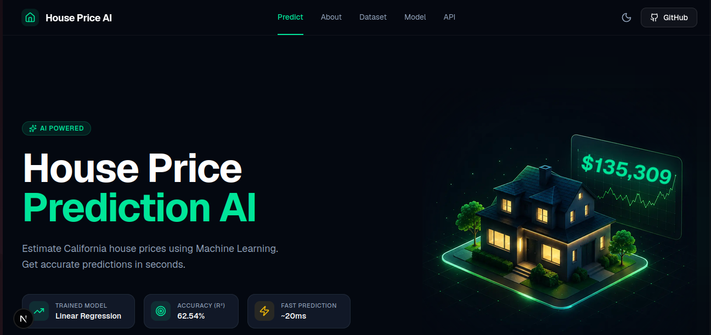

# 🏠 PricePilot AI - House Price Prediction

PricePilot AI is an end-to-end Machine Learning web application that predicts California house prices using the **best-performing regression model** selected automatically after evaluating multiple machine learning algorithms.

The application combines a Scikit-Learn ML pipeline, FastAPI backend, and a modern Next.js frontend to deliver fast and accurate house price predictions.

---

## 📸 Screenshot



---

# 🚀 Live Demo

### Frontend

https://house-price-prediction-ai-peach.vercel.app/

### Backend API

https://house-price-prediction-ai-harm.onrender.com/

### Swagger Documentation

https://house-price-prediction-ai-harm.onrender.com/docs

---

# ✨ Features

- 🏠 Predict California house prices
- 🤖 Compare multiple Machine Learning models
- 🥇 Automatically select the best-performing model
- ⚡ FastAPI REST API
- 🎨 Modern Next.js interface
- 📊 Scikit-Learn preprocessing pipeline
- ✅ Zod form validation
- 🔄 TanStack Query API integration
- 📱 Fully responsive design
- ⚡ Real-time prediction time measurement

---

# 🛠 Tech Stack

## Frontend

- Next.js
- TypeScript
- Tailwind CSS
- shadcn/ui
- React Hook Form
- Zod
- TanStack Query
- Axios

## Backend

- FastAPI
- Pydantic
- Uvicorn

## Machine Learning

- Scikit-Learn
- Pandas
- NumPy
- Joblib

---

# 🤖 Machine Learning Pipeline

### Data Preprocessing

- Missing Value Imputation
- One-Hot Encoding
- ColumnTransformer
- Scikit-Learn Pipeline

### Models Evaluated

| Model | R² Score |
|--------|----------|
| 🥇 Random Forest | **0.8169** |
| Gradient Boosting | 0.7615 |
| Decision Tree | 0.6352 |
| Linear Regression | 0.6254 |

### Selected Production Model

**Random Forest Regressor**

The training pipeline automatically evaluates all models and saves the best-performing model.

---

# 📈 Model Performance

| Metric | Value |
|---------|-------:|
| MAE | **31,636.35** |
| RMSE | **48,977.06** |
| R² Score | **0.8169** |

---

# 📂 Project Structure

```text
house-price-prediction-ai/
│
├── backend/
│   └── app/
│
├── frontend/
│
├── ml/
│   ├── config.py
│   ├── pipeline.py
│   └── train.py
│
├── data/
├── models/
├── screenshots/
│
├── pyproject.toml
├── uv.lock
└── README.md
```

---

# ⚙️ Installation

## Clone Repository

```bash
git clone https://github.com/nikshadali/house-price-prediction-ai.git

cd house-price-prediction-ai
```

---

## Install Dependencies

```bash
uv sync
```

---

## Train the Model

```bash
uv run -m ml.train
```

This command:

- compares all regression models
- selects the best-performing model
- saves the trained pipeline into:

```text
models/house_price_pipeline.pkl
```

---

## Run Backend

```bash
uv run uvicorn backend.app.main:app --reload
```

Backend

```
http://localhost:8000
```

Swagger

```
http://localhost:8000/docs
```

---

## Run Frontend

```bash
cd frontend

npm install

npm run dev
```

Frontend

```
http://localhost:3000
```

---

# 📡 API Endpoint

### POST

```
/api/v1/predict
```

### Example Request

```json
{
  "longitude": -122.23,
  "latitude": 37.88,
  "housing_median_age": 41,
  "total_rooms": 880,
  "total_bedrooms": 129,
  "population": 322,
  "households": 126,
  "median_income": 8.3252,
  "ocean_proximity": "NEAR BAY"
}
```

### Example Response

```json
{
  "predicted_price": 431942.36
}
```

---

# 🚀 Future Improvements

- XGBoost
- LightGBM
- Hyperparameter Tuning
- Prediction History
- Explainable AI (SHAP)
- Docker
- CI/CD
- Authentication
- User Dashboard

---

# 👨‍💻 Author

**Nikshad Ali**

GitHub

https://github.com/nikshadali